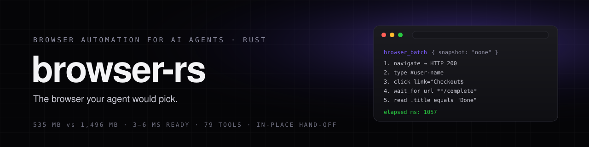

# browser-rs

[](https://www.rust-lang.org) [](https://modelcontextprotocol.io) [](https://googlechromelabs.github.io/chrome-for-testing/) [](#8-limits) [](LICENSE)

I wanted a browser my agents actually like using. So I built one in Rust, on a bundled Chromium,
with the tools of Microsoft's Playwright MCP, and then let Opus agents do real, multi-step work with
it and fixed everything they complained about, round after round.

It uses **535 MB where Playwright MCP needs 1,496 MB** over the same four real pages, navigates
20–35% faster, and is ready in 3–6 ms. It reads pages as Markdown instead of giant snapshots, runs
many steps per call, and when a login needs a human, it hands them the exact live page without
reloading anything.

Website: [browser-rs.lukaloehr.com](https://browser-rs.lukaloehr.com)

---

## 1. What it does

- **Playwright MCP's tools, same names and parameters.** 34 by default, 79 with `--caps all`:
  navigation, snapshots with element refs, trusted clicks, typing, drag and drop, dialogs, uploads,
  tabs, network mocking, cookies and storage, screenshots, PDF, tracing, video, test assertions.
- **Reading without snapshots.** `browser_text` returns the page as Markdown (the article, one
  section, or just the opening paragraph), `browser_links` lists links as one line each,
  `browser_table`, `browser_extract` and `browser_read` pull exactly the values you need.
- **Fewer round trips.** `browser_batch` runs navigate, type, click, wait and read in one call, and
  a `read` step with `equals` turns into an assertion. Every action can skip its snapshot
  (`snapshot: "none"`); by default a reply shows only the lines that changed.
- **The web beyond the page.** `browser_fetch` sends HTTP with the browser's cookies directly (no
  CORS), trimming JSON to the `fields` you ask for or running a `transform`. `browser_scrape` reads
  many URLs at once in background tabs.
- **In-place human hand-off.** `browser_handoff` opens a live view of the running page in a tab of
  your own browser. You click, type, paste and answer dialogs; nothing restarts or reloads. Measured
  over the viewer's own connection: input to visible change p50 16 ms, 60 fps while animating.
- **Measured, not guessed.** Every reply ends with `elapsed_ms`; `BROWSER_RS_TRACE=<file>` logs each
  call with its duration and reply size.

## 2. Built by its users

Six Opus agents, restricted to browser-rs, each got a hard real-world task: researching GitHub pull
requests, a Wikipedia link race, Hacker News with the linked articles, a full e-commerce checkout
with its error cases, fourteen tricky widgets (dialogs, uploads, iframes, shadow DOM, drag and drop),
and debugging on MDN. Each timed its steps with the server's own numbers and reported bugs, friction
and the tools it wished it had. Their requests became the code between rounds.

| Round | Scores (0–10) | Satisfied | Would pick over Playwright MCP | Cost |
|---|---|---|---|---|
| 1 | 5 · 8 · 7 · 7 · 5 · 5 | 0 of 6 | 3 of 6 | $4.57 |
| 2 | 7 · 8 · 7 · 8 · 7 · 8 | 0 of 6 | 6 of 6 | $2.71 |
| 3 | 8 · 8 · 7 · 8 · 8 · 7 | 4 of 6 | 6 of 6 | $2.67 |
| 4 | 8 · 8 · 7 · 9 · 8 · 8 | 2 of 6 | 6 of 6 | $1.67 |

The Wikipedia race went from 75,000 characters of tool replies and 7.6 s of browser time to 3,400
characters and 0.9 s. The harness lives outside this repo; the tasks and prompts are described in
the commit history.

## 3. System

```
 agent ──stdio/MCP──▶ browser-rs (Rust, ~9.5 MB)
                         │  DevTools Protocol over two pipes (fd 3/4), no websocket, no port
                         ▼
               chrome-headless-shell 153 ─── headless work (default)
               Chrome for Testing 153 ────── only for --headed / browser_set_mode
                         │
          hand-off:  Page.startScreencast ──▶ 127.0.0.1 viewer (random token) ──▶ your browser tab
                     trusted Input.dispatch* ◀── mouse, keys, paste, dialogs ◀──┘
```

A `--watchdog` process next to each Chromium holds a pipe from the server and takes the whole
browser process group down if the server dies, even by SIGKILL. No orphaned Chromium, ever.

## 4. Architecture

| Path | Role |
|---|---|
| `src/cdp.rs` | DevTools Protocol client on `--remote-debugging-pipe`: NUL-delimited JSON, one event handler, one-shot waiters |
| `src/install.rs` | Downloads and locates the pinned Chrome for Testing builds |
| `src/browser.rs` | Launch, tab state from CDP events, navigation with HTTP status, headless ↔ headed relaunch, watchdog |
| `src/actions.rs` | Trusted input, evaluate, screenshots, PDF, storage, routes, server-side fetch, parallel scrape, tracing, video |
| `src/injected.js` | Runs in an isolated world of every page: accessibility snapshot and refs, actionability checks, Markdown, links, tables, reads |
| `src/response.rs` | Playwright-style replies, snapshot modes and diffs, compact console summary |
| `src/tools.rs` | The MCP tools, per-call options, batch dispatch, timing and tracing |
| `src/liveview.rs`, `src/liveview.html` | The hand-off viewer: token-protected local server, screencast relay, input forwarding |
| `src/keys.rs` | Playwright key names to CDP key events |
| `scripts/bench_browser.py` | The benchmark against `@playwright/mcp` |

Before every click the page runtime waits until the element is attached, visible, stable, not
animating, enabled and actually hit at its center; if something covers it, the error names what.

## 5. Quickstart

```sh
git clone https://github.com/luka-loehr/browser-rs
cd browser-rs && cargo build --release
claude mcp add browser-rs "$PWD/target/release/browser-rs"
```

Chromium downloads itself on the first tool call (chrome-headless-shell, ~99 MB), or ahead of time
with `target/release/browser-rs install`, which also fetches the full browser for headed mode. The
cache is `~/Library/Caches/browser-rs` (Linux: `~/.cache/browser-rs`).

Or paste this into your agent and let it do the setup:

```
Install browser-rs for me. Run `curl -fsSL https://browser-rs.lukaloehr.com/setup.txt`
first, then follow it exactly.
```

## 6. Tools

**Default (34):** `browser_navigate`, `browser_navigate_back`, `browser_snapshot`, `browser_find`,
`browser_click`, `browser_hover`, `browser_type`, `browser_fill_form`, `browser_select_option`,
`browser_press_key`, `browser_drag`, `browser_drop`, `browser_file_upload`, `browser_handle_dialog`,
`browser_evaluate`, `browser_wait_for`, `browser_take_screenshot`, `browser_resize`, `browser_tabs`,
`browser_console_messages`, `browser_network_requests`, `browser_network_request`, `browser_close`,
`browser_install`, and the agent tools `browser_text`, `browser_links`, `browser_table`,
`browser_extract`, `browser_read`, `browser_fetch`, `browser_scrape`, `browser_batch`,
`browser_handoff`, `browser_set_mode`.

**With `--caps`:** `vision` (coordinate mouse), `pdf`, `network` (route, offline), `storage`
(cookies, localStorage, sessionStorage, storage state), `devtools` (tracing, video, highlights,
recording), `testing` (locators, verify), `config`. `--caps all` enables everything.

**Targets** accept a snapshot ref (`e12`), a CSS selector (the first visible match wins;
`iframe#x >> body` enters an iframe or shadow root), `text=…`, `role=button[name="…"]`,
`link=<regex>` or `href=/wiki/C++`.

**The fast way to drive it:**

1. Read with `browser_text`, `browser_links`, `browser_table`, `browser_extract`, `browser_read` or
   `browser_fetch`, not snapshots.
2. Act with refs or selectors, several steps per `browser_batch`, `snapshot: "none"` when you don't
   need to see the page.
3. Read many pages with `browser_scrape`; trim APIs with `browser_fetch` `fields` or `transform`.
4. Hand the page to a person with `browser_handoff` when they have to log in.

## 7. Options

Same names as `@playwright/mcp` where they exist:

```
--headless / --headed           start headless (default) or with a visible window
--caps <list>                   vision,pdf,network,storage,devtools,testing,config or all
--executable-path <path>        your own Chromium or Chrome (also BROWSER_RS_EXECUTABLE)
--user-data-dir <path>          --isolated                    --storage-state <path>
--viewport-size <WxH>           --user-agent <ua>             --ignore-https-errors
--proxy-server <url>            --proxy-bypass <domains>      --block-service-workers
--allowed-origins <a;b>         --blocked-origins <a;b>       --init-script <path>
--output-dir <path>             --test-id-attribute <name>
--snapshot-mode <mode>          incremental (default), full or none
--snapshot-max-chars <n>        default 50000; action replies inline at most 8000
--timeout-action <ms> (5000)    --timeout-navigation <ms> (60000)    --timeout-settle <ms> (500)
```

Environment: `BROWSER_RS_CACHE`, `BROWSER_RS_TRACE`, `BROWSER_RS_NO_VIEWER` (tests), `BROWSER_RS_DEBUG`.

## 8. Limits

- Tested on macOS. Linux uses the same code but is untested; Windows is not supported (the pipe
  transport and the watchdog are Unix-only).
- In the hand-off view, headless Chromium does not draw native `<select>` dropdowns, date pickers or
  file choosers, and passkeys do not work; use a one-time code or a password.
- `browser_set_mode` relaunches Chromium, so pages reload; use `browser_handoff` when state matters.
- Not implemented: `browser_run_code_unsafe` (needs Playwright's Node runtime), `browser_annotate`,
  `browser_resume`, and the `--device`, `--mobile`, `--init-page` and `--config` options.
- Cross-origin iframes are not part of snapshots; same-origin iframes and open shadow roots are.

## 9. Benchmarks

Against `@playwright/mcp@0.0.80`, both on chrome-headless-shell, same four pages (example.com, a
Wikipedia article, Hacker News, a GitHub repository), three rounds, medians, memory summed over the
whole process tree. Reproduce with `python3 scripts/bench_browser.py`.

| | browser-rs | Playwright MCP |
|---|---|---|
| Memory after 4 pages | **535 MB · 5 processes** | 1,496 MB · 9 processes |
| Navigate Wikipedia / Hacker News / GitHub | **214 / 185 / 274 ms** | 315 / 229 / 330 ms |
| `browser_snapshot` on GitHub | **26 ms** | 36 ms |
| Server ready | **3–6 ms** | 574 ms |
| Tool schemas in the agent's context | **15.9k chars** | 19.5k chars |

## 10. License

MIT, see [LICENSE](LICENSE). Tool names follow Microsoft's `@playwright/mcp`; no Playwright code is
included. Chromium for Testing is downloaded from Google under its own licences.

Made by [Luka Löhr](https://lukaloehr.com). This repository grew out of
`rust-mcp-servers`, whose browser server it was; its history is kept here.
